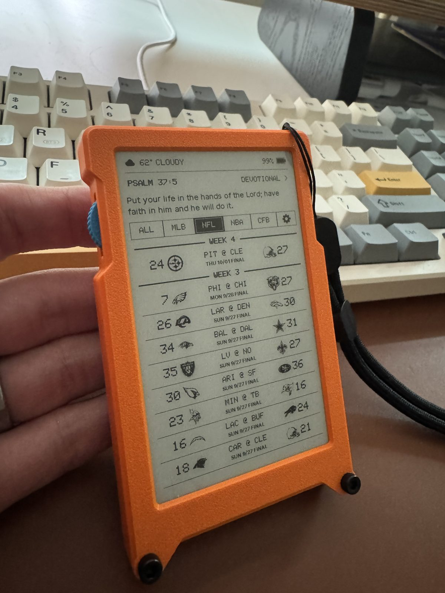
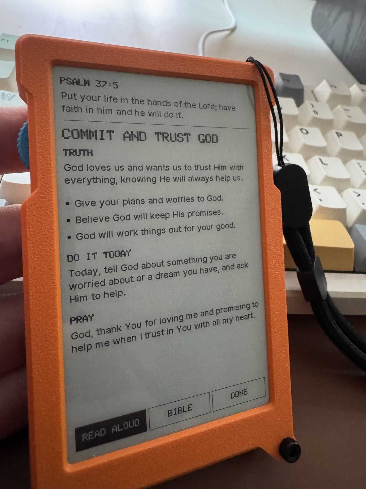
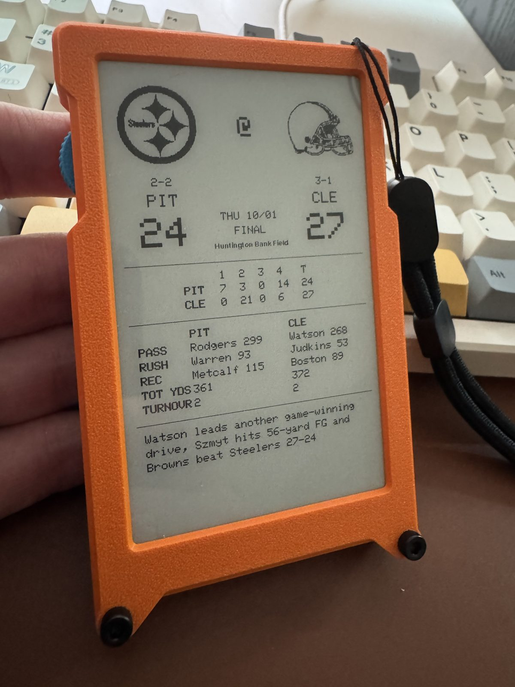

# Pixel League

A small e-paper companion for a kid's desk: the day's Bible verse and devotional, the latest sports scores, and the weather — on a 4-inch screen that holds its image without power, with a rocker switch to browse and a voice you can ask questions. It runs on the Waveshare ESP32-S3-ePaper-3.97 board (480 × 800 e-paper, microphone, speaker, battery) and lasts weeks on a charge.

  
  
  

## What's on the device

**The launcher.** The first screen shows the weather, today's verse, and the latest scores across every league. The rocker moves between three doors: the forecast, the Bible, and the scoreboard.

**Bible.** The whole Bible lives on the board and reads offline, in a choice of four translations with a one-line description of each so parents can pick: the Berean Standard Bible, the Free Bible Version, the Bible in Basic English, and the King James. A reading position is remembered, pages turn with the rocker across chapters and books, there is a book and chapter picker, and the text size can be small, normal or large.

**Daily devotional.** Each day has a short, gospel-centered devotional for ages 7–13 built on the verse of the day: the verse, a title, one truth, three bullets, something to do today, and a one-line prayer. It fits on one screen, can be read aloud by the speaker, and the verse of the day everywhere on the device is the devotional's verse. Devotionals are written as simple Markdown files in this repository (`devotionals/`), one per day, and reach the device over Wi-Fi; the whole library is kept on the board so it works offline. A day with no file gets one written on the spot.

**Sports scores.** MLB, NFL, NBA and college football: recent results and today's games in a dense scoreboard, grouped by league and week, with team logos; a matchup page with the box score, team leaders and a headline; team pages with results, the next game, and division and conference standings. Scores refresh while the device is awake and whenever it wakes up.

**Weather.** Current conditions on the launcher and a seven-day forecast page, for the location you give it (or where its network says it is).

**Voice.** Hold the rocker and ask. "Bears score", "NFL standings", "go to Psalm 23", "read today's devotional", "will it rain tomorrow", "who won the 1985 Super Bowl" — the device opens the right page or answers out loud, in a voice you can choose. It sticks to sports, the Bible and the weather, and looks up current facts (like who's starting at quarterback) rather than guessing.

**Settings.** Wi-Fi setup from a phone, spoken replies on or off, the speaking voice, dark mode, the nightly sleep schedule, and a check for software updates.

**Battery life.** The board sleeps when it's idle and overnight, showing the verse of the day while asleep, wakes on any button, and wakes once each morning to fetch the day's devotional, verse, weather, scores and any software update. In practice that's a few percent of battery a day.

## Setting one up

1. Flash the firmware over USB (`tools/build.sh`, then `tools/flash.sh <port>`), then load the Bible and devotionals (`tools/upload_bible.sh <port>`). `tools/bootstrap.sh` installs the build tools the first time.
2. Add the voice key over USB (`tools/device_console.py key`); it stays on the device and is never in this repository.
3. Turn it on and join its Wi-Fi setup page from a phone: home Wi-Fi, timezone, and a ZIP code for the weather.

After that the device looks after itself: it checks GitHub for new firmware each morning and installs it on its own, and pulls new or edited devotionals the same way.

## Making changes

- **Devotionals:** add or edit `devotionals/MM-DD.md`, run `tools/build_devotionals.py` (it checks each one fits the screen, and can draft missing days), commit and push. Devices pick them up within hours.
- **Firmware:** `tools/release.sh 1.7.0 "notes"` runs the tests, builds, tags, and publishes a release that every device installs over Wi-Fi.
- **Checking a device:** `tools/device_console.py` talks to a board over USB — status, a screen capture, a forced devotional or weather fetch, a storage map.

`VALIDATION.md` keeps the running log of what was built, why, and how each piece was verified on the hardware; `PRD.md` holds the product intent.

## License

The code, tools and documentation are released under the [MIT License](LICENSE). The devotionals are [CC BY 4.0](devotionals/LICENSE). Third-party components keep their own terms, listed in [THIRD_PARTY_NOTICES.md](THIRD_PARTY_NOTICES.md) and below.

## Credits and licenses

- Bible text: the Berean Standard Bible (public domain, Bible Hub), the Free Bible Version (© 2018 Jonathan Gallagher, CC BY-SA 4.0), the Bible in Basic English and the King James Version (public domain), the latter three from [eBible.org](https://ebible.org).
- Scores from ESPN's public endpoints; weather from [Open-Meteo](https://open-meteo.com); voice, speech and devotional drafting through OpenRouter.
- Team logos are the property of their owners and are used for identification. Inter font under the SIL Open Font License (`assets/fonts/OFL.txt`).
- Built on the [Waveshare ESP32-S3-ePaper-3.97](https://docs.waveshare.com/ESP32-S3-ePaper-3.97) with its display driver (`vendor/`), [Adafruit GFX](https://github.com/adafruit/Adafruit-GFX-Library) and [ArduinoJson](https://arduinojson.org/).
